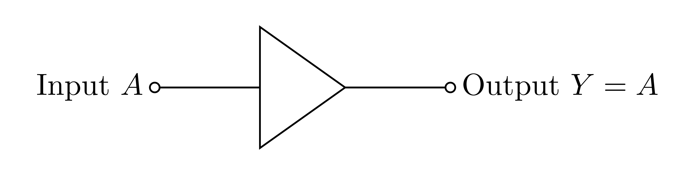
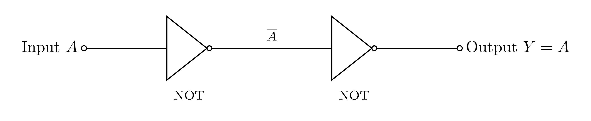
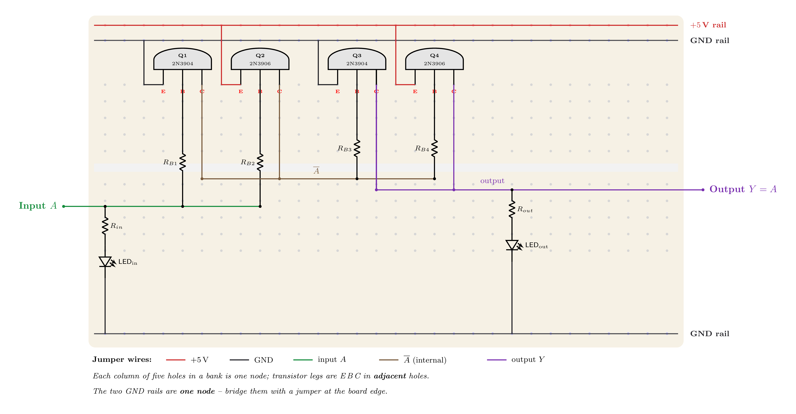
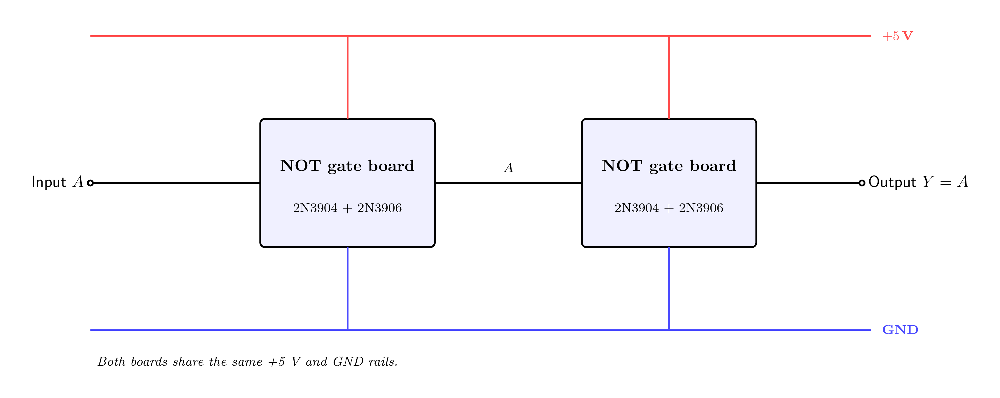

# Buffer Gate

A buffer gate **outputs the same value as its input** (`Y = A`). It does not change the logic
level, but it **cleans up and re-drives the signal** to full, solid voltage levels.

This buffer is built the simplest possible way — it is just **two NOT gates in a row**, so
there is nothing new to design at the transistor level. Each NOT stage is the complementary
`2N3904 + 2N3906` inverter from the [`not`](https://github.com/mrmhmdalmalki/not-gate)
folder. The whole gate — both stages — fits on **one half-size (400-point) breadboard**, with
indicator LEDs on the external input and output only.

### Symbol

A triangle pointing in the direction of signal flow. (A NOT gate is this same triangle **plus a
bubble** on the output; a buffer is two NOT gates, so the two bubbles cancel.)



### Truth table

| Input `A` | Output `Y` |
|:---------:|:----------:|
| 0 | 0 |
| 1 | 1 |

---

## How it is built

> buffer = NOT( NOT(A) ) = A

Two NOT gates in series. The first inverts `A` to `Ā`; the second inverts `Ā` back to `A`. Two
inversions cancel, so the output equals the input — but now re-driven to a clean, strong
`~4.8 V` for `1` and `~0.2 V` for `0`.



Because each NOT stage is the complementary push-pull inverter, the output is **actively
driven** and can comfortably feed the next gate. That is the whole point of a buffer: restore a
tired or marginal signal back to a full, strong logic level.

---

## Building it on a breadboard

The whole buffer — **4 transistors** — fits on **one half-size (400-point) breadboard**. All
four share the same TO-92 pinout (flat face toward you, legs down, **E B C** left to right),
and here the legs sit in **adjacent holes**:


The wiring picture below is the actual breadboard build, every connection a **colour-coded
jumper** (see the legend). Each column of five holes in a bank is one node. The **top rail
pair** carries `+5 V` (outer) and `GND` (inner) for the transistor emitters; the **bottom
rail** is `GND` for the LED returns — the two GND rails are **one node**, so bridge them with
a jumper at the board edge.



Connect the four transistors as follows:

| Transistor | E (emitter) | B (base) | C (collector) |
|:-----------|:------------|:---------|:--------------|
| **Q1 — 2N3904 (NPN, stage 1)** | **GND** | through R_B1 (10 kΩ) to Input `A` | node `Ā` |
| **Q2 — 2N3906 (PNP, stage 1)** | **+5 V** | through R_B2 (10 kΩ) to Input `A` | node `Ā` |
| **Q3 — 2N3904 (NPN, stage 2)** | **GND** | through R_B3 (10 kΩ) to node `Ā` | **Output Y** |
| **Q4 — 2N3906 (PNP, stage 2)** | **+5 V** | through R_B4 (10 kΩ) to node `Ā` | **Output Y** |

The internal node `Ā` (stage 1's output, stage 2's input) is a **plain jumper run** — no LED,
no board-to-board wire. Then add the two indicators:

- **Input LED:** Input `A` → R_in (220 Ω) → LED → GND.
- **Output LED:** Output `Y` → R_out (220 Ω) → LED → GND.

Quick test: Input `A` = +5 V gives Output ≈ +5 V; Input `A` = GND gives Output ≈ GND (a buffer
copies the input). The middle node `Ā` is always the opposite of both.

---

## Alternative: build from finished gate boards

If you already have NOT-gate boards built, the buffer is also just **two finished NOT boards**
wired in series — no new parts at all:



| Block | Build guide | Input | Its output goes to |
|:------|:------------|:------|:-------------------|
| **NOT board 1** | [not-gate](https://github.com/mrmhmdalmalki/not-gate) | Input `A` | the input of NOT board 2 (this node is `Ā`) |
| **NOT board 2** | [not-gate](https://github.com/mrmhmdalmalki/not-gate) | `Ā` (output of board 1) | Output `Y = A` |

Both boards share the **same +5 V rail and the same GND**. `+5 V` and `GND` are **nodes**, not
physical positions, so either rail of your breadboard can be the +5 V rail.

---

## Components

For the compact single-board build:

| Part | Qty | Job |
|:-----|:---:|:----|
| 2N3904 (NPN) | 2 | pull-down transistor of each stage (Q1, Q3) |
| 2N3906 (PNP) | 2 | pull-up transistor of each stage (Q2, Q4) |
| 10 kΩ resistor | 4 | base resistors R_B1–R_B4, one per transistor |
| 220 Ω resistor | 2 | LED current limiters R_in, R_out |
| indicator LED | 2 | input and output state |

(The alternative two-board build uses the same transistors but each NOT board carries its own
full LED set — see the [`not`](https://github.com/mrmhmdalmalki/not-gate) folder.)

### Power

- One **+5 V** rail and a common **GND** (0 V) reference.

---

## Standards and references

**Gate symbol.** The distinctive-shape symbol follows the ANSI/IEEE standard for logic graphic symbols:

- IEEE Std 91-1984 and 91a-1991, *Graphic Symbols for Logic Functions* ([standards.ieee.org](https://standards.ieee.org/ieee/91_91a/241/)). The distinctive shapes originate from US MIL-STD-806; the international equivalent is IEC 60617-12.
- Free explainer: Texas Instruments, *Overview of IEEE Standard 91-1984* (PDF) ([ti.com](https://www.ti.com/lit/ml/sdyz001a/sdyz001a.pdf)).
- Symbols and truth tables overview: *Logic gate*, Wikipedia ([wikipedia.org](https://en.wikipedia.org/wiki/Logic_gate)).

**Transistor circuit.** Each NOT stage is a complementary (CMOS-style) push-pull inverter — a matched NPN/PNP pair sharing one output:

- *Push–pull / complementary output*, Wikipedia ([wikipedia.org](https://en.wikipedia.org/wiki/Push%E2%80%93pull_output)).
- *CMOS inverter*, Wikipedia ([wikipedia.org](https://en.wikipedia.org/wiki/CMOS#Inversion)).
- P. Horowitz and W. Hill, *The Art of Electronics*, 3rd ed., Cambridge University Press, 2015.
- A. S. Sedra and K. C. Smith, *Microelectronic Circuits*, Oxford University Press.
- T. L. Floyd, *Digital Fundamentals*, Pearson (logic-gate symbols and truth tables).

**Transistor parts.** 2N3904 NPN, onsemi datasheet ([PDF](https://www.onsemi.com/pdf/datasheet/2n3904-d.pdf)). 2N3906 PNP, onsemi datasheet ([PDF](https://www.onsemi.com/pdf/datasheet/2n3906-d.pdf)).

---

## Regenerating the diagrams

```bash
pdflatex circuit.tex
pdflatex symbol.tex
pdflatex wiring.tex
pdflatex boards.tex
pdftoppm -png -r 400 circuit.pdf images/circuit   # -> images/circuit-1.png
pdftoppm -png -r 400 symbol.pdf  images/symbol     # -> images/symbol-1.png
pdftoppm -png -r 400 wiring.pdf  images/wiring     # -> images/wiring-1.png
pdftoppm -png -r 400 boards.pdf  images/boards     # -> images/boards-1.png
```

> Use `pdftoppm`, not `pdftocairo`, at high DPI the Cairo backend can garble the fonts.
